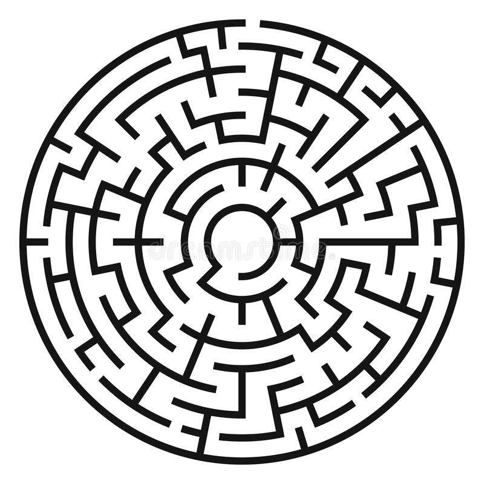
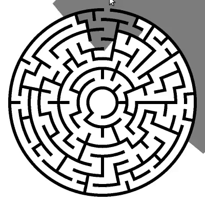
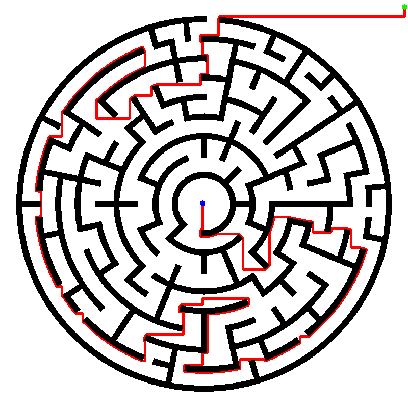

# Maze solver using path finding algorithm A*
Maze solver using the A* path finding algorithm with a visualization. The image processing is made using python and opencv. The path finding is implemented in C++ and visualized also using opencv.
<br/>
[A* algorithm](https://en.wikipedia.org/wiki/A*_search_algorithm) 
## Usage:
1. Download the repository
2. Go to /src/c/
3. Compile the solver running ```make```
4. Go back to the root folder
5. Run ```python3 main.py```
6. Select image containing the maze
7. Click in two points of the image to define the origin and the target
8. Close the image and obtain the result

Note: Install opencv, it is required for the visualization

## Example:<br/>
Maze to be solved:<br/>
<br/>
Solving process:<br/>
<br/>
Result:<br/>
<br/>
